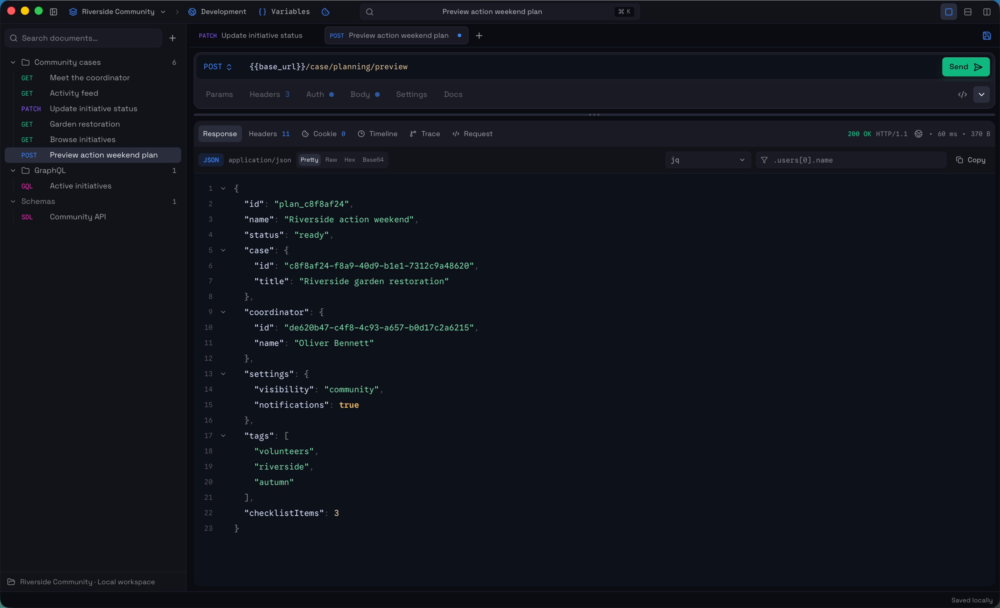

<p align="center">
  
</p>

<h1 align="center">Purr</h1>

<p align="center">
  A local-first desktop client for HTTP and GraphQL APIs.
</p>

<p align="center">
  <a href="https://github.com/purr-app/Purr/actions/workflows/ci.yml"></a>
  <a href="LICENSE"></a>
</p>



Purr keeps API projects readable and portable while native code handles the work that should stay outside the web view. Workspace definitions live in Git-friendly YAML, SDL, and asset files. Drafts, tabs, layout, history, cookies, and caches stay local. Credentials are represented by stable references and stored separately in the operating system's secure store.

Purr is under active development. The repository currently targets macOS for the complete desktop security model; other platforms need native secure-storage adapters before they can be considered supported.

## Features

- HTTP requests with parameters, headers, inherited settings, multiple body types, redirects, cookies, and cancellation.
- Bearer, Basic, API key, and OAuth 2.0 authentication with credentials kept outside project files.
- GraphQL editing, schemas, introspection, variables, and language support.
- Environments with static, dynamic, scoped, and secret variables.
- Response viewers for structured text, raw data, hex, Base64, HTML, images, audio, video, and binary downloads.
- Response search plus a documented jq/JSONPath-compatible query subset.
- Git-friendly workspaces with folders, tabs, drafts, external-change handling, and local response history.
- cURL paste/copy and OpenAPI 3.0/3.1 import from a file, folder, URL, or pasted document.
- Jaeger tracing with W3C/B3 propagation, request correlation, trace search, and a virtualized waterfall viewer.
- A curated TypeScript and Rust extension surface for composing integrations and separate product modules at build time.

## Getting started

Purr requires Node.js 24, npm 11, Rust 1.89 or newer, and the platform prerequisites for [Tauri 2](https://v2.tauri.app/start/prerequisites/).

```bash
git clone https://github.com/purr-app/Purr.git
cd Purr
npm ci
npm run tauri dev
```

For browser-only UI development, run `npm run dev`. The browser adapter does not provide native HTTP, filesystem, Keychain, OAuth callback, download, or desktop security behavior.

## Development

Run the main checks before opening a pull request:

```bash
npm run check:repo
npm test
npm run test:ui
npm run typecheck
npm run lint
npm run build

cd src-tauri
cargo fmt --check
cargo clippy --all-targets -- -D warnings
cargo test
```

The root package reserves the `@purr/core` identity and is not currently published to npm. `npm run build:core` produces the curated `./app`, `./extension-api`, `./ui`, `./test-kit`, and `./styles` exports in `dist-core`. `npm run check:core-package` validates those exports with an external frontend and Tauri shell fixture.

## Architecture

The application uses React and TypeScript for the UI and application layers. Tauri and Rust own native HTTP, filesystem persistence, encrypted local state, macOS Keychain access, OAuth callbacks, downloads, large response content, and tracing providers.

Start with [AGENTS.md](AGENTS.md) for repository conventions, then use the subsystem documentation:

- [System architecture](docs/architecture.md)
- [Request lifecycle](docs/request-lifecycle.md)
- [Response lifecycle](docs/response-lifecycle.md)
- [Workspaces and navigation](docs/workspaces.md)
- [Environments, variables, and secrets](docs/environments-and-variables.md)
- [Authentication and cookies](docs/auth.md)
- [Persistence architecture](docs/persistence-architecture.md)
- [GraphQL](docs/graphql.md)
- [Imports and integrations](docs/imports-and-integrations.md)

## Contributing

See [CONTRIBUTING.md](CONTRIBUTING.md) for contribution rules and the required validation. Please report security issues through the private process in [SECURITY.md](SECURITY.md).

## Licensing

The public Purr core in this repository is licensed under the [MIT License](LICENSE). The Purr name, logo, icon, and branding are governed separately by the [trademark policy](TRADEMARK.md). Some integrations and commercial features may be developed and distributed separately under proprietary licenses and are not covered by this repository's MIT License.

Bundled third-party fonts and artwork remain under their respective licenses; see [THIRD_PARTY_NOTICES.md](THIRD_PARTY_NOTICES.md).
