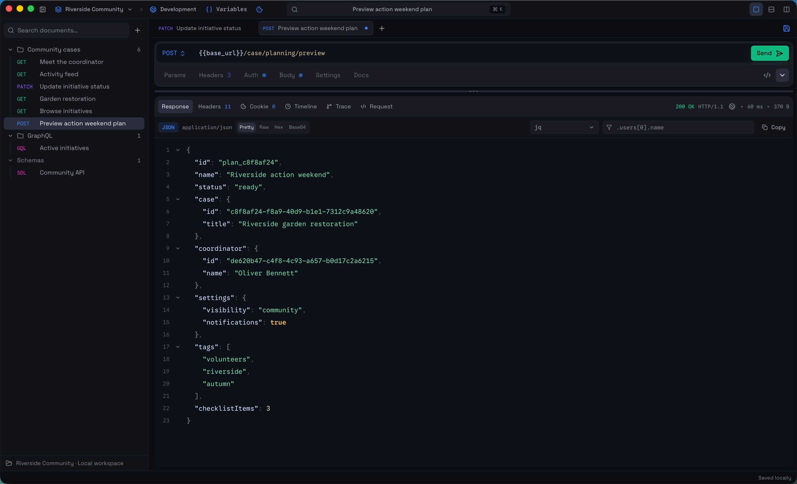

<p align="center">
  
</p>

<h1 align="center">Purr</h1>

<p align="center">
  A local-first HTTP &amp; GraphQL client for macOS — with dynamic variables, OpenAPI import, and request-to-trace debugging.
</p>

<p align="center">
  Send a request. Inspect the response. Follow the trace.
</p>

<p align="center">
  <strong><a href="https://usepurr.com/">Download for macOS</a></strong> ·
  <a href="https://usepurr.com/">Website</a> ·
  <a href="https://github.com/purr-app/Purr/releases">GitHub Releases</a> ·
  <a href="#architecture">Documentation</a>
</p>

<p align="center">
  <a href="https://github.com/purr-app/Purr/actions/workflows/ci.yml"></a>
  <a href="LICENSE"></a>
</p>



## Why Purr?

- **Local-first.** Workspaces stay on your machine. No account is required, and project files are readable and Git-friendly.
- **GraphQL-native.** Schema introspection, autocomplete, documentation, schema exploration, and variables are part of the request workflow.
- **Request → trace.** Connect Jaeger and open a request's correlated trace from the response to inspect backend execution without manually searching for trace IDs.

Purr has an [open-source core](#licensing), including the HTTP, GraphQL, and Jaeger workflows described below.

## Features

### HTTP & Authentication

- HTTP requests with parameters, headers, inherited settings, multiple body types, redirects, cookies, and cancellation.
- Bearer, Basic, API key, and OAuth 2.0 authentication with credentials kept outside project files.

### GraphQL

- Query and mutation editing with variables, schema-aware autocomplete, validation, and hover documentation.
- Reusable schema connections with introspection or schema import, type and field exploration, and request generation from root fields.

### Variables & Request Chaining

- Environments with static, dynamic, scoped, and secret variables.
- Chain HTTP and GraphQL requests by extracting values from a saved request's JSON response into dynamic variables. Dependencies run before the request that needs them.
- Per-variable refresh and cache policies, with dependency diagnostics and source-request execution history.

### Responses

- Response viewers for structured text, raw data, hex, Base64, HTML, images, audio, video, and binary downloads.
- Response search and filtering with a documented [jq/JSONPath-compatible query subset](docs/response-lifecycle.md#jq-and-jsonpath-extraction).
- Workspace and per-request history with saved request/response snapshots, replay, pinning, and configurable retention.

### Imports

- OpenAPI 3.0/3.1 import from a file, folder, URL, or pasted document.
- Postman Collection v2.0/v2.1 and environment JSON import, with warnings for unsupported content such as scripts and saved response examples.
- Paste cURL commands into requests and copy effective requests as cURL.

### Tracing

- Jaeger integration with W3C/B3 trace propagation and correlation from request or response headers.
- Open the response's Trace tab to inspect a virtualized span waterfall, timings, and attributes, or follow the trace in Jaeger.
- Search spans and attributes within the loaded trace. Requires a configured Jaeger server exposing the [Query API v3](docs/imports-and-integrations.md#jaeger-adapter).

### Local-first Workspaces

- Workspaces with folders, tabs, drafts, and external-change handling, with no account required.
- Portable, Git-friendly YAML, GraphQL SDL, and asset files; session state, history, cookies, and caches stay local.
- Credentials stored separately in an encrypted local vault, with secret references in project files.

## Install Purr

[Download Purr for macOS](https://usepurr.com/).

See [GitHub Releases](https://github.com/purr-app/Purr/releases) for core release notes and source archives.

Purr is under active development. macOS is the supported desktop platform; other platforms still need native secure-storage adapters.

## Build from source

Building Purr requires Node.js 24, npm 11, Rust 1.89 or newer, and the platform prerequisites for [Tauri 2](https://v2.tauri.app/start/prerequisites/).

```bash
git clone https://github.com/purr-app/Purr.git
cd Purr
npm ci
npm run tauri dev
```

For browser-only UI development, run `npm run dev`. The browser adapter does not provide native HTTP, filesystem, Keychain, OAuth callback, download, or desktop security behavior.

## Development

Run the main checks before opening a pull request:

```bash
npm run check:repo
npm test
npm run test:ui
npm run typecheck
npm run lint
npm run build

cd src-tauri
cargo fmt --check
cargo clippy --all-targets -- -D warnings
cargo test
```

The root package reserves the `@purr/core` identity and is not currently published to npm. `npm run build:core` produces the curated `./app`, `./extension-api`, `./ui`, `./test-kit`, and `./styles` exports in `dist-core`. `npm run check:core-package` validates those exports with an external frontend and Tauri shell fixture.

## Architecture

The application uses React and TypeScript for the UI and application layers. Tauri and Rust own native HTTP, filesystem persistence, encrypted local state, legacy macOS Keychain migration, OAuth callbacks, downloads, large response content, and tracing providers.

Workspace definitions live in Git-friendly YAML, SDL, and asset files. Drafts, tabs, layout, history, cookies, and caches stay local. Credentials are represented by stable references and stored separately through `SecureStore` in an encrypted local vault.

A curated TypeScript and Rust extension surface supports composing integrations and separate product modules at build time.

Start with [AGENTS.md](AGENTS.md) for repository conventions, then use the subsystem documentation:

- [System architecture](docs/architecture.md)
- [Request lifecycle](docs/request-lifecycle.md)
- [Response lifecycle](docs/response-lifecycle.md)
- [Workspaces and navigation](docs/workspaces.md)
- [Environments, variables, and secrets](docs/environments-and-variables.md)
- [Authentication and cookies](docs/auth.md)
- [Persistence architecture](docs/persistence-architecture.md)
- [GraphQL](docs/graphql.md)
- [Imports and integrations](docs/imports-and-integrations.md)
- [Versioning and releases](docs/releases.md)

## Contributing

See [CONTRIBUTING.md](CONTRIBUTING.md) for contribution rules and the required validation. Please report security issues through the private process in [SECURITY.md](SECURITY.md).

## Licensing

The public Purr core in this repository is licensed under the [MIT License](LICENSE). The Purr name, logo, icon, and branding are governed separately by the [trademark policy](TRADEMARK.md). Some integrations and commercial features may be developed and distributed separately under proprietary licenses and are not covered by this repository's MIT License.

Bundled third-party fonts and artwork remain under their respective licenses; see [THIRD_PARTY_NOTICES.md](THIRD_PARTY_NOTICES.md).
